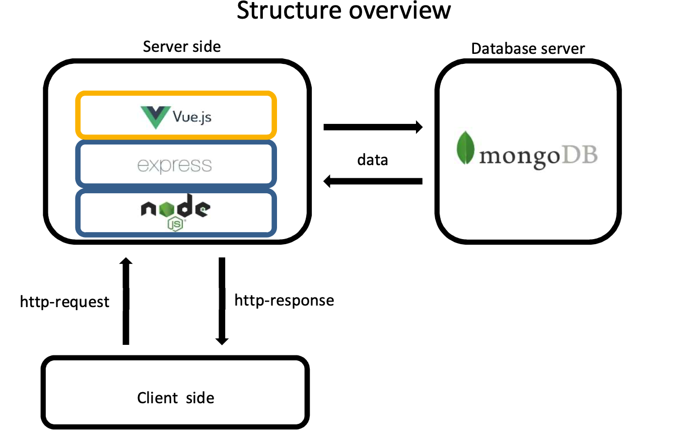
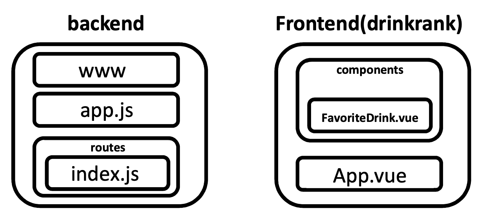

# FavoriteDrinks - MongoDB, Express.js, Node.js, Vue.js(MEVN Stack)

# HTTP Webserver - Favorite Drink Selector
2022 Fall Semester Computer Network Project

*Comments are written in the codes. Please read along the comments to comprehend codes.*  
_This project is licensed under the MIT License - see the LICENSE.md file for details_

**Currently Deployed!** => www.bigdreams.co.kr
Enjoy!

## Description
This project mainly aims on fully functional web server based on node.js runtime.  
This service provides the rankings of various drinks determined by user-active likes.   

### Structure Overview
   


## Getting Started

```
npm install

node /bin/www
```

### Files   



### Usage

Feel free to use this project as MEVN template to deploy very simple web server projects.
